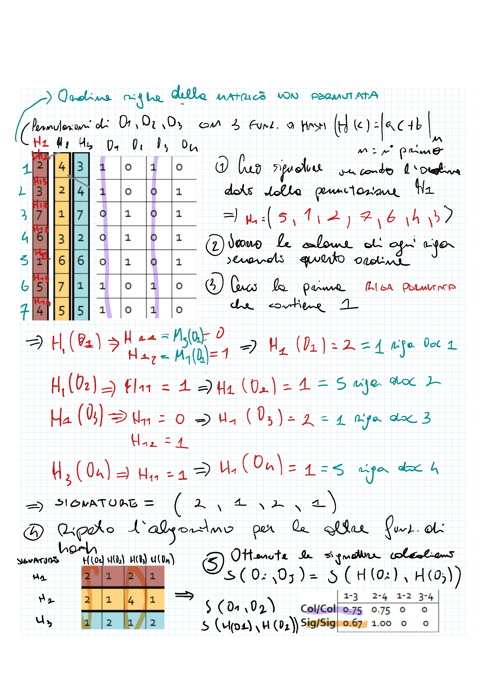

- # Ricerca di documenti simili
title:: Finding Similar Items
- 
- # Shingling
	- Partiamo con una collezione di documenti $D$. Ogni documento $d \in D$ è una sequenza di caratteri.
	- È necessario trovare una rappresentazione vettoriale per ogni documento $d \in D$. Per ogni documento si ha una un vettore, e quindi la collezione è rappresentata da una matrice.
	- ## K - Shingling
		- È una tecnica per identificare sottostringhe di lunghezza $k$ all'interno di un testo o documento. Per creare la rappresentazione vettoriale, si utilizza un vettore binario, in cui ogni posizione rappresenta una possibile combinazione di $k$ caratteri. Se la combinazione appare nel documento, la posizione corrispondente nel vettore viene impostata a 1, altrimenti viene impostata a zero.
		- Il valore di $k$ viene scelto in base alla granularità desiderata. Se si sceglie un valore di $k$ piccolo, il vettore risultante avrà molti elementi a 1 poiché è probabile che tutti i caratteri dell'alfabeto compaiano in un documento. D'altra parte, se si sceglie un valore di $k$ troppo elevato, si rischia di ottenere rappresentazioni vettoriali troppo grandi da gestire.
		
		- > **_Esempio:_** se il documento è `“Ciao mondo”`, una rappresentazione 2-shingling del documento sarebbe `{“Ci”, “ia”, “ao”, “mo”, “on”, “nd”, “do”}`.
		- In realtà gli shingles totali sarebbero n° lett
		- > **_Oss:_** è possibile utilizzare il k-shingling per estrarre sottoinsiemi di parole all'interno di un testo. In questo caso, si parla di *n-grammi*.
		- > **_Esempio:_** Se applichiamo il k-shingles ad un documento con k = 2, si hanno $26^2$ possibili combinazioni di caratteri (coppie delle lettere dell'alfabeto), e quindi sono necessari $26^2 = 676$ elementi per rappresentare un documento.
	- ## Bag of Words (Bow)
		- È una tecnica che permette di rappresentare un documento come un vettore di frequenze di parole. In altre parole, si considera un insieme di parole $W$ e si crea un vettore $v$ di dimensione $|W|$, dove ogni posizione $i$ rappresenta una parola $w_i \in W$ e il valore $v_i$ rappresenta il numero di volte che la parola $w_i$ appare nel documento.
		- > **_Esempio:_** se il documento è `“Ciao mondo”`, una rappresentazione bag of words del documento sarebbe `{“Ciao”: 1, “mondo”: 1}`.
		- > **_Oss:_** è possibile utilizzare il bag of words per estrarre sottoinsiemi di parole all'interno di un testo. In questo caso, si parla di *n-grammi*.
		- > **_Esempio:_** Se applichiamo il bag of words ad un documento, si hanno $|W|$ possibili combinazioni di parole, e quindi sono necessari $|W|$ elementi per rappresentare un documento.
	- Una volta che sono state ottenute le rappresentazioni vettoriali dei documenti, è possibile calcolare la similarità tra gli stessi attraverso la **similarità di Jaccard**, definita come il rapporto tra l'intersezione degli insiemi campionari e l'unione degli insiemi campionari.
		
		- > **_Esempio:_** se $A = \{1,2,3\}$ e $B = \{2,3,4\}$, allora $J(A,B) = \frac{A \cap B}{A \cup B} = \frac{2}{4} = 0.5$
		- > **_Oss:_** Nel caso di rappresentazioni vettoriali di questo tipo, la similarità di Jaccard può essere ottenuta implementando l'AND logico al numeratore e l'OR logico al denominatore.
	- > **_Problema:_** 

	- La matrice é di vettori sparsi.

	- Se vogliamo confrontare i duplicati fra N documenti, dobbiamo confrontare ogni documento con tutti gli altri per calcolarne la similarità.

		- $N(N-1)/2$ confronti 

	- È necessario ridurre il numero di righe,e il numero di confronti.

	
	
- # Minhashing

	- Riduce la dimensione di ogni colonna $C$ (quindi il numero di righe, cioè il n° di shingles) 
	- Viene mappata **ogni colonna** $C$ in una **signature** $h(C)$ di dimensione inferiore rispetto a $C$.
		- si ottiene una matrice di signature
			- ogni colonne è la signature di un documento
			- ogni riga è ottenuta da una funzione di hash tc:	
				
	I documenti hashati devono preservare la similarità tra i documenti originali:
	- $s(C_1,C_2) \approx s(h(C_1),h(C_2))$
		- se la $sim(C_1,C_2)$ è alta, allora con alta probabilità $h(C_1) = h(C_2)$
		- se la $sim(C_1,C_2)$ è bassa, allora con alta probabilità $h(C_1) \neq h(C_2)$

	Funzioni di hash del tipo - $h(c) = ai + b$ mod $N$ permette di ottenere una signature di dimensione $N$.
	- $i$ è l'indice della riga della matrice degli shingles
	- $a$ e $b$ sono parametri della funzione di hash
	- $N$ è un numero primo
- si ottiene una permuazione delle righe della matrice degli shingles

	- ### Costruzione della signature matrix
		- Considerare una serie di permutazioni delle righe della matrice di input (la matrice ottenuta tramite lo shingling);
		- Considerare la matrice permutata, scorrere le colonne e salvare l'indice di riga dove compare il primo valore 1;
		- Ripeto il procedimento per ogni permutazione in modo da ottenere la _signature matrix_;
		- Al termine confronto la similarità tra documenti utilizzando la signature matrix.
		- > **_Esempio:_**
			
		

	
	- > **_Oss:_** per avere una certa stabilità, è necessario che ci siano un certo numero di righe nella signature matrix, quindi bisogna considerare lo stesso numero di permutazioni.

		- > **_Eempio:_** per ridurre u documento di $10^6$ shingles di un un ordine di grandezza di $10^3$, è necessario considerare $10^3/2$ - $10^3$ permutazioni.

		- All'aumentare del numero di permutazioni, la similarità tra documenti calcolata con la signature matrix si avvicina sempre di più alla similarità calcolata con la matrice originale.

		- $P(h(C_1) = h(C_2)) \rightarrow S(C_1,C_2)$,
		- quando il numero di permutazioni tende a infinito.
	
	- > **_Oss:_**
		- Dobbiamo scorrere tutte le righe delle matrie permutataper creare la signature matrix.
		- é un processo temporalmente costoso.
		- per ridurre il tempo di esecuzione si può fare un'ottimizzazione:
			- possiamo ridurre il n° di permutazioni quando nelle prime tre righe della matrice permutata non ci sono 1.
			- il valore di minhashing è indefinito se non ci sono 1 nelle prime tre righe della matrice permutata.
	
	- > **_Problema:_** utilizzando il minhashing si riduce il n° di elementi del vettore colonna, ma non il n° di colonne, quindi il n° di confronti rimane $N(N-1)/2$.
	- > **_Soluzione:_** Locality Sensitive Hashing (LSH)
	
- ## Locality Sensitive Hashing (LSH)
	
	
	- appplica una funzione di hashing alla signature matrix.
	- raggruppa i documenti con stesso valore di hash in un bucket.
	- i documenti che finiscono nello stesso bucket sono candidati duplicati.
	- non effettua confronti tra tutti i documenti, ma solo tra quelli che sono candidati duplicati.
	- Riduce il numero di confronti tra documenti.
	
	
	- > **_Problema:_** 
	- alcuni documenti sono duplicati ma non finiscono nello stesso bucket. Questi documenti sono detti falsi negativi.
	- alcuni documenti che non sono duplicati possono finire nello stesso bucket. Questi documenti sono detti falsi positivi.

	- > **_Oss:_** è possibile utilizzare più funzioni di hashing per ridurre il numero di falsi positivi.
	

	- ### Algoritmo di partizione della signature matrix
	- Dividere la _signature matrix_ in $b$ bande con $r$ righe. In altre parole, si suddivide la signature di ciascun documento in chunks contigui ma distinti.
		
		- > **_Esempio:_**
			{:height 314, :width 674}
	- Per ogni banda, eseguire una funzione di hashing su tutti i chunks e memorizzare i risultati in $k$ *backets* in una *hash table*.
		
		- > **_Oss:_** viene utilizzata una has table separata per ogni banda. Quindi si confrontano i chunks solo all'interno della stessa banda piuttosto che tra bande diverse.
	- Se due items (documenti) finiscono nello stesso backet di una hash table per una qualsiasi delle bande, li consideriamo candidati.
		
		- > **_Esempio:_**
			 
			+ In questo caso le coppie di candidate sono: `(artist_3, artist_5)` e `(artist_1, artist_5)`
		- > **_Oss:_** sebbene l'immagine rappresenti una hash table con solo quattro backets, in realtà il *numero di buckets* $k$ è *solitamente molto maggiore del numero di items* (documenti).
	- ### Scelta di $b$ e $r$
		- $b$ e $r$ devono essere scelti in modo tale da catturare la maggior parte delle coppie simili, e poche coppie non simili.
		- La probabilità che due documenti abbiano lo stesso valore di minhashing in una qualsiasi riga della signature matrix è uguale alla similarità di Jaccard $s$ di quei due documenti.
		- **È possibile calcolare la probabilità che due documenti siano una coppia candidata come segue:**
			- Se ogni banda $b$ ha $r$ righe, allora la probabilità che le signatures di due documenti siano uguali per tutte le righe di una banda è: $\boxed{s^r}$
			- La probabilità che le signatures di due documenti non siano uguali in almeno una riga di una banda è: $\boxed{1- s^r}$
			- La probabilità che le signature di due documenti non siano uguali in almeno una riga di tutte le bande è: $\boxed{(1-s^r)^b}$
			- La probabilità che le signature di due documenti siano uguali in tutte le righe di almeno una banda (e quindi essere coppia candidata) è: $\boxed{1-(1-s^r)^b}$
		- Quindi la probabilità che due documenti siano una coppia candidata è una funzione in $s$ con parametri $r$ e $b$: $\boxed{1-(1-s^r)^b}$. La funzione è una curva as S.
			- > **_Esempio:_**
				{:height 370, :width 415}
				+ In questo esempio, se due items hanno una similarità di Jaccard di 0.5, hanno solo una probabilità pari a 0.23 di essere una coppia candidata.
			- > **_Oss:_** aumentando il numero di bande $b$, e quindi anche il numero di funzioni di hash, e riducendo il numero di righe $r$ (mantenendo il prodotto $b*r$ costante), si incrementa efficacemente la probabilità di trovare coppie candidate. Ciò equivale in altre parole a ridurre la soglia di similarità $t$, che può essere approssimata come: $\boxed{(1/b)^{(1/r)}}$
				{:height 370, :width 415}
				+ In questo esempio, se due items hanno una similarità di Jaccard di 0.5, hanno una probabilità pari a 0.57 di essere una coppia candidata.