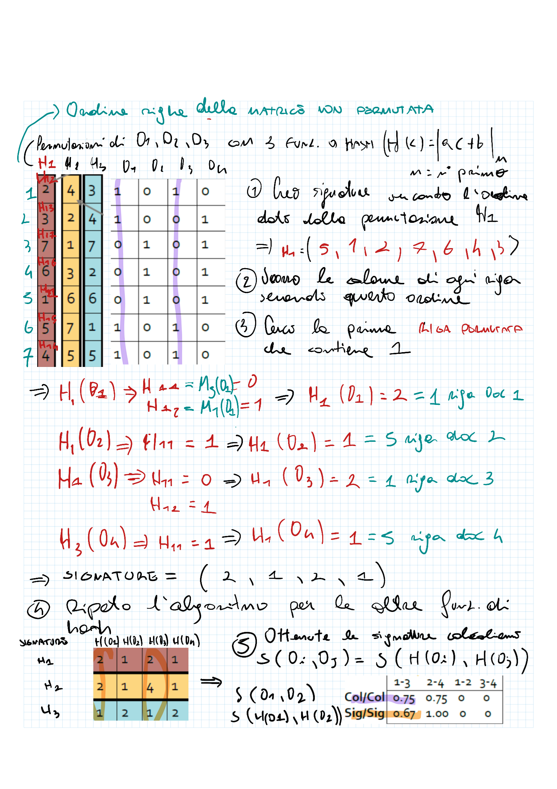

- # Market Basket Model
  title:: Frequent Itemsets
	- Si vuole trovare un insieme di regole associative fra insiemi di elementi
	- 
	- Identifico insiemi di oggetti comprati insieme
	  logseq.order-list-type:: number
	- cerco di ottenere regole generale per fornire relazioni fra oggetti.
	- 
		
	- Il modello _Market Basket Model_ è un modello di dati utilizzato per analizzare i comportamenti  di acquisto dei clienti e identificare le relazioni tra gli elementi acquistati.
	- L'obiettivo è identificare le relazioni tra gli elementi, in modo da poter fare raccomandazioni sugli articoli correlati o creare strategie di vendita incrociata. Ciò viene fatto scoprendo gli **"itemset frequenti"**, che sono insiemi di elementi che si verificano insieme con una frequenza superiore a una soglia prestabilita.
		- > **_Esempio:_** se molti clienti acquistano latte e pane insieme, è possibile considerare l'itemset {latte, pane} come un itemset frequente.
	- ## Definizione
		- Ogni *"basket"* è composto da un set di *"items"*;
			- Il numero di items in ogni basket è molto minore del numero totale di items;
		- Un set che compare in molti basket costituisce un *"frequent itemset"*;
			- Se un set compare nei basket con una frequenza maggiore di una certa soglia, chiamata *"soglia di supporto"* $s$, allora è un frequent itemset.
			- > **_Esempio:_**
			  + *Items*: {milk, coke, pepsi, beer, juice}
			  + *Support threshold* $s$: 3 baskets
			  + *Baskets*: B1 = {milk, coke, beer}, B2 = {milk, pepsi, juice}, B3 = {milk, bread}, B4 = {coke, juice}, B5 = {milk, pepsi, beer}, B6 = {milk, coke, beer, juice}, B7 = {coke, beer, juice}, B8 = {beer, coke}
			  + *Frequent Itemsets*: {milk}, {coke}, {beer}, {juice}, {milk, bread}, {bread, coke}, {coke, juice}
			- > **_Oss:_** Questo metodo diventa troppo complesso quando si hanno troppi items. Ho un numero di operazioni di lettura/scrittura pari al coefficiente binomiale $\binom{n}{k}$, dove $n$ è il numero di items, e $k$ è un valore variabile che indica la dimensioni dei frequent itemsets che stiamo considerando (i.e. $k=2$ coppie di items, $k=3$ triplette di items,...).
			- 
	- ## Applicazioni
		- **Market baskets:**
		  Identificando gli insiemi di elementi frequenti, è possibile scoprire associazioni e modelli tra articoli che vengono comunemente acquistati insieme. Queste informazioni sono preziose per le ricerche di mercato, i sistemi di raccomandazione dei prodotti e il miglioramento delle strategie di merchandising.
		- **Concetti correlati:**
		  Estrazione di regole di associazione, quindi scoprire relazioni tra elementi o eventi per trovare associazioni interessanti.
		- **Rilevamento del plagio:**
		  Rappresentando i documenti come insiemi di parole o n-grammi, è possibile identificare insiemi frequenti di frasi o sequenze di parole che compaiono in più documenti. Questi itemset frequenti possono servire come indicatori di potenziale plagio, aiutando a identificare i casi in cui i
		  documenti condividono porzioni significative di testo.
	- ## Regole di associazione
		- Spesso, l’identificazione di frequent itemsets consiste nell’individuare regole di associazione (_association rules_) tra items presenti nei baskets.
		- Queste associazioni, che costituiscono una collezione di regole if-then, seguono il formato “se I, allora j”. In altre parole, se un insieme di elementi $I$ compare in un basket, è probabile che l’elemento $j$ sia presente nello stesso
		  basket.
		- In un caso reale, generalmente si hanno moltissime regole di associazione, e quindi è necessario trovare le più significative attraverso la **confidenza** (*confidence*):
		  $$\text{conf}(I \rightarrow j) = \frac{\text{support}(I \cup j)}{\text{support}(I)}$$
		  dove:
		  + $\text{support}(I \cup j)$ è il numero di baskets dove compaiono tutti gli items di $I$ e l'item $j$
		  
		  + $\text{support}(I)$ è il numero di baskets dove compaiono tutti gli items di $$I$$
		- >  **_Oss:_** la confidenza è un valore sempre minore di 1.
		- Quando un item compare in quasi tutti i basket, va a generare una regola inutile. Quindi, una volta trovata una regola significativa, è necessario calcolare l'**interesse** (*interest*), definita come:
		  $$\text{interest}(I \rightarrow j) = \text{conf}(I \rightarrow j) - p(j)$$
	- > **_Esempio:_**
	  	
	- Gli algoritmi per gli itemsets frequenti richiedono una gestione attenta dei conteggi e una quantità sufficiente di memoria RAM per un'elaborazione efficiente. L'accesso frequente al disco può causare rallentamenti significativi, ma esistono **algoritmi** appositamente **progettati per ridurre l'impatto sulla memoria** e aumentare la velocità di lettura e scrittura dei dati.
	  collapsed:: true
		- ### Metodo della Matrice Triangolare
			- Gli items di solito sono rappresentati come stringhe.
			- mappiamo ogni stringa sd un intero univoco.
			- Una volta rappresentati gli elementi come interi, si memorizza il conteggio delle coppie ${i,j}$ all'interno di una matrice bidimensionale.
			- > **_Esempio:_** l'elemento $a_{i,j}$ della matrice contiene  il conteggio della coppia $\{i,j\}$.
			- > **_Oss:_** Poiché le coppie $$\{i,j\}$$ e $$\{j,i\}$$ sono equivalenti, la matrice è simmetrica. Questo vuol dire che metà della matrice viene utilizzata inutilmente.
			- la matrice è un array bidimensionale
			- l'accesso all'elemento $a_{i,j}$ sarà fatto con doppio ciclo for
			- Per migliorare l'efficienza. è possibile utilizzare un vettore riga
			- ogni elemento viene acceduto come $a_{i,j} = v[k]$, dove $k$ è l'indice del vettore
			  
			  $$\boxed{k = (i - 1)(n - \frac{i}{2}) + j - i}$$
			- > **_Esempio:_** supponiamo di avere gli elementi {A, B, C, D} rappresentati dagli interi {1, 2, 3, 4}. Se vogliamo memorizzare il conteggio delle coppie, ad esempio {A, B}, {B, C}, {A, D}, possiamo utilizzare un array triangolare unidimensionale come segue:
			  + *Array*: `[a[1], a[2], a[3], a[4], a[5], a[6]]`
			  + *Coppie rappresentate*:`{1, 2}, {2, 3}, {1, 4}`
			  + *Indici*: `[1, 2, 3, 4, 5, 6]`
			  La coppia `{A, B}` viene memorizzata in `a[1]`, la coppia `{B, C}` in `a[2]` e la coppia `{A, D}` in `a[5]`.
			- > **_Oss:_** In questo metodo possono esserci degli elementi del vettore che restano a zero, occupando spazio in memoria inutilmente.
			- Si cerca un modo per non salvare gli itemset che non compaiono nei dati.
		- ### Metodo delle triple
			- Invece di memorizzare solo il conteggio di ogni itemset, viene memorizzata una tripla $$[i ,j , c]$$ dove $i$ e $j$ sono gli item e $c$ è il conteggio.
			- Viene utilizzata una struttura dati, come una hash table, per consentire l'accesso alle triple per una data coppia.
			- Se il conteggio per una coppia è zero, non è necessario memorizzare nulla, risparmiando spazio.
			- > **_Oss:_** Questo metodo richiede lo spazio aggiuntivo per memorizzare tre interi per ogni coppia che appare nei dati, e lo spazio per la struttura dati utilizzata nel retrieval.
			- > **_Oss:_** **Metodo della matrice triangolare vs Metodo delle triple**
			  + Il metodo della matrice triangolare è più efficace in termini di spazio se almeno 1/3 delle coppie possibili effettivamente compare nei dati;
			  + Il metodo delle triple è più efficace, se meno di 1/3 delle coppie possibili compare nei dati.
		
		- ### Algoritmo A-Priori
		  	
			- L'algoritmo A-Priori è un classico algoritmo di ricerca delle associazioni.
			- È utilizzato per la generazione degli itemset frequenti, per approssimazioni successive, a partire dagli itemset con un solo elemento
			- si basa sul **principio di monotonicità degli itemsets**, che afferma che se un itemset è frequente, allora tutti i suoi  subitemsets devono essere anch'essi frequenti.
			- **Step 1**
				- Convertire gli elementi da stringhe a interi da 1 a n;
				- Contare le occorrenze di ciascun elemento. In altre parole, determinare la frequenza di ciascun 1-itemset (itemset formato da un singolo elemento);
			- **Step 2**
				- Conservare gli itemsets che superano la *soglia di supporto* desiderata;
			- **Step 3**
				- A partire dagli itemsets frequenti di dimensione $k$ generati nel passo precedente, generare gli itemsets di dimensione $k + 1$ senza generare duplicati.
			- **Step 4**
				- Ripetere i passaggi 2 e 3 finché non vengono generati nuovi itemsets frequenti. L'algoritmo continua a generare e valutare itemsets candidati di dimensione crescenti finché non vengono più trovati itemsets frequenti o viene raggiunta la dimensione massima definita.
			- > **_Esempio:_** Supponiamo di avere il seguente insieme di transazioni:
			  
			  | **Transazioni** | **Itemsets** |
			  |-----------|-----------|
			  | T1  | {1,2,3,4} | 
			  | T2  | {1,2,4}  |
			  | T3  | {1,2}  | 
			  | T4  | {2,3,4} | 
			  | T5  | {2,3} | 
			  | T6  | {3,4} |
			  | T7  | {2,4} |
			  
			  + Assumiamo una soglia di supporto $s$ pari a 3. Quindi un itemset è frequente se compare almeno in 3 transazioni.
			  + *Step 1*: contare il numero di occorrenze (_support_) di ciascun elemento.
			  
			  | **Item** | **Support** |
			  |-----------|-----------|
			  | {1} | 3 | 
			  | {2} | 6 |
			  | {3} | 4 | 
			  | {4} | 5 |
			  
			  + *Step 2*: tutti gli itemset di dimensione 1 hanno un supporto di almeno 3, quindi sono tutti frequenti.
			  + *Step 3*: generare itemsets di dimensione $k + 1$ a partire dagli itemsets frequenti di dimensione $k$.
			  
			  | **Item** | **Support** |
			  |-----------|-----------|
			  | {1,2} | 3 |
			  | {1,3} | 1 | 
			  | {1,4} | 2 |  
			  | {2,3} | 3 |
			  | {2,4} | 4 | 
			  | {3,4} | 3 |
			  
			  + *Step 2*: le coppie {1,2}, {2,3}, {2,4} e {3,4} soddisfano o superano il supporto minimo di 3, quindi sono considerate frequenti. D'altra parte, le coppie {1,3} e {1,4} non raggiungono il supporto minimo e non sono considerate frequenti. Poiché queste coppie non sono frequenti, possiamo affermare che qualsiasi insieme più grande che le contiene non sarà frequente. Pertanto, possiamo eliminare gli insiemi che includono {1,3} o {1,4} dalla successiva ricerca di itemset frequenti.
			  + *Step 3*:
			  
			  | **Item** | **Support** |
			  |-----------|-----------|
			  | {2,3,4} | 2 |
			  
			  + *Step 2*: {2,3,4} è al di sotto della soglia minima e gli altri itemsets con $k = 3$ sono stati esclusi perché contenevano itemsets non frequenti.
		- L'algoritmo a priori in questo caso fa un passaggio per ogni k (dimensione del subset) ma se la memoria è troppo poca per mantenere i dati bisogna adottare una soluzione diversa. Ci sono casi in cui non è necessario scoprire ogni frequent itemset, possiamo prendere solo una porzione dei basket ma in questo caso possiamo perdere alcuni frequent itemset.
### **Algoritmo di Park, Chen, and Yu (PCY)**
- Sfrutta l'osservazione che nel primo passaggio dell'a priori c'è molta più memoria non utilizzata, perciò:
	- Le stringhe vengono mappate a interi da 1 a n
	- Conto gli elementi singoli di ogni itemset
	- Fisso una soglia di support.
	- Se il conteggio del singoletto non superano la support come prima tutti gli itemset che contengono quel singoletto sono esclusi a priori dal conteggio.
	- Con N funzioni di hash si creano N bucket con possibili coppie di items frequenti
	-  una hash table che restituisce un conteggio delle possibili coppie per ogni elemento
	
		- se abbiamo 4 items (1,2,3,4):
			- se 1 supera la support conterò le occorrenze di: (1,2), (1,3), (1,4)
				- la somma totale delle occorrenze di queste coppie deve superare la soglia di supporto per essere considerata frequente.
		- Si sommano le occorrenze di tutte le coppie che cotengono quel singoletto senza ripetizione:
			- se anche 2 è frequente si contano solo le coppie (2,3) e (2,4) senza contare (1,2) perchè già contata.
	- per tutti i bucket che superano la soglia si predono le coppie contenute e si contano le occorrenze.
	- i bucket che non superano la soglia vengono scartati e con loro tutte le coppie contenute.
	- alla prossima iterazione verranno considerate solo le coppie dei bucket che hanno superato la soglia.
	- si ripete finche nessun items supera la soglia
	- questo algoritmo permette di risparmiare un notevole numero di conteggi di coppie 
	
		
	- 
	- ### **The Simple, Randomized Algorithm**
		- Si prende solo un sottoinsieme randomico dei baskets e si tratta come se fosse l'intero dataset.
			- Si deve risistemare il support threshold per il ridotto numero di basket. (e.g. sample dell' 1% del totale allora la nuova soglia di supporto sarà almeno s/100)
			- Il modo migliore per prendere questi sottoinsiemi e selezionare basket con una probabilità p fissata.
			- Dopodiché si usa un algoritmo come quello a priori.
		- *il problema di questi algoritmi è che producono molti falsi negativi e falsi positivi.*
			- Per eliminare i falsi positivi si fa un passaggio attraverso tutto il dataset, e si contano tutti gli item identificati come frequenti nel sample.
			- I falsi negativi non possono essere individuati in questo modo.
			- Per ridurre i falsi negativi si abbassa la soglia di supporto, a discapito di un aumento dei falsi positivi che verranno eliminati nel passaggio successivo.

	- ### **SON**
		- L'algoritmo SON si basa sulla divisione del dataset o del file di input in chunks (blocchi) e sulla ricerca degli itemsets frequenti in ogni chunk.
		- Vengono utilizzate due soglie di supporto: una *soglia di supporto globale* $s$ e una *soglia di supporto* $ps = \frac{s}{|chunk|}$ *per ogni chunk*, che rappresenta una frazione $p$ del file di input.
		- In ogni chunk, gli itemset con supporto maggiore o uguale a $ps$ vengono considerati frequenti e salvati su disco. Gli itemset frequenti trovati vengono combinati per formare un insieme di itemsets candidati.
		- Gli itemsets che hanno un supporto almeno pari ad $s$ vengono considerati frequenti.
		- L'algoritmo può essere implementato utilizzando due applicazioni di **[[MapReduce]]**:
			- **First Map**
				- La prima funzione di Map, prende in ingresso un chunk del file di input e trova gli itemset frequenti attraverso una tecnica qualsiasi, considerando la soglia di supporto $ps$.
			
				- Il risultato è un insieme di coppie chiave-valore $(F, 1)$ dove la chiave $F$ è un frequent itemset. Il valore è sempre 1 ed è irrilevante.
			- **First Reduce**
				- La prima funzione di Reduce, combina la chiavi ottenute dai diversi chunk e restituisce gli itemsets candidati.
				
			- **Second Map**
				- La seconda funzione di Map prende in ingresso tutti gli itemsets candidati e un chunk per volta e conta il numero di occorrenze nella porzione di file considerata.
				- Il risultato è un insieme di coppie $(C, v)$, dove $C$ è uno degli itemset candidati e $v$ è il conto delle occorrenze all'interno della porzione considerata.
			- **Second Reduce**
				- La seconda funzione di Reduce aggrega le coppie e somma i valori associati.
				- Il risultato è il supporto totale per ogni itemset.
				- Gli itemsets caratterizzati da un supporto maggiore o uguale alla soglia globale $s$ sono i frequent itemsets finali.
	- ### Algoritmo di Toivonen
		- L'algoritmo di Toivonen è un algoritmo per l'estrazione di elementi frequenti. Funziona selezionando un piccolo campione casuale dal dataset e utilizzando questo campione per identificare gli insiemi di elementi che sono frequenti.
			- **Selezione dei campioni:**
				
				Si seleziona casualmente un campione del dataset.
			- **Identificazione dei frequent items candidati:**
				
				Vengono identificati i frequent itemsets con una tecnica qualsiasi all'interno del campione. A tale scopo viene impostata una soglia di supporto  proporzionale al campione considerato.
			- **Costruzione del bordo negativo:**
				
				Viene identificato il bordo negativo, ovvero l'insieme degli elementi che non sono frequenti nel campione, ma tutti i loro sottoinsiemi immediati sono frequenti nel campione.
				- > **_Oss:_** Gli itemsets nel bordo negativo potrebbero potenzialmente essere frequenti nell'intero dataset, quindi dobbiamo tenerli in considerazione.
			- **Scansione dell'intero dataset:**
				logseq.order-list-type:: number
				Viene effettuato un passaggio sull'intero dataset per contare la frequenza degli itemsets. Durante questa scansione, vengono contati sia gli itemsets che sono stati considerati frequenti, sia quelli all'interno del bordo negativo.
			- **Risultati:**
				logseq.order-list-type:: number
				Possono esserci due possibili risultati:
				- *Nessun elemento del bordo negativo è frequente nell'intero dataset*: In questo caso, possiamo affermare con certezza che gli insiemi di elementi frequenti nel campione sono anche frequenti nell'intero dataset.
					logseq.order-list-type:: number
				- *Un elemento del bordo negativo è frequente nell'intero dataset*: In questo caso, non possiamo essere sicuri se ci sono insiemi ancora più grandi, sia nel bordo negativo che nell'insieme di insiemi di elementi frequenti nel campione, che sono anche frequenti nell'intero dataset.
					logseq.order-list-type:: number
					> **_Oss:_** in questo caso è necessario ripetere l'algoritmo con un nuovo campione e ripetere le valutazioni.
			- > **_Esempio:_** il nostro dataset contiene una serie di transazioni di acquisto.
				  
				| Transazioni | Itemsets |
				|--------------|-----------|
				| T1 | {A,B,C} |
				| T2 | {B,C,D} |
				| T3 | {A,C,D} |
				| T4 | {B,D} |
				| T5 | {A,B,C,D} |
				
				+ SelezionIamo casualmente un campione, per esempio le prime tre transazioni: `{A,B,C},{B,C,D},{A,C,D}`
				+ Identifichiamo gli itemsets frequenti impostando una soglia di supporto pari a 2, troviamo che `{A},{B},{C},{D},{B,C},{CD}` sono itemsets frequenti nel campione. Il bordo negativo è composto da `{A,B},{A,C},{A,D},{B,D}`
				+ Scansioniamo l'intero dataset: `{A},{B},{C},{D},{B,C},{CD}` sono itemsets frequenti nel dataset mentre nessun itemset del bordo negativo è frequente nell'intero dataset.\
				+ Gli itemsets `{A}, {B}, {C}, {D}, {B, C}, {C, D}` sono effettivamente frequenti in tutto il dataset.

- # Ricerca di documenti simili
title:: Finding Similar Items
- 
- # Shingling
	- Partiamo con una collezione di documenti $D$. Ogni documento $d \in D$ è una sequenza di caratteri.
	- È necessario trovare una rappresentazione vettoriale per ogni documento $d \in D$. Per ogni documento si ha una un vettore, e quindi la collezione è rappresentata da una matrice.
	- ## K - Shingling
		- È una tecnica per identificare sottostringhe di lunghezza $k$ all'interno di un testo o documento. Per creare la rappresentazione vettoriale, si utilizza un vettore binario, in cui ogni posizione rappresenta una possibile combinazione di $k$ caratteri. Se la combinazione appare nel documento, la posizione corrispondente nel vettore viene impostata a 1, altrimenti viene impostata a zero.
		- Il valore di $k$ viene scelto in base alla granularità desiderata. Se si sceglie un valore di $k$ piccolo, il vettore risultante avrà molti elementi a 1 poiché è probabile che tutti i caratteri dell'alfabeto compaiano in un documento. D'altra parte, se si sceglie un valore di $k$ troppo elevato, si rischia di ottenere rappresentazioni vettoriali troppo grandi da gestire.
		
		- > **_Esempio:_** se il documento è `“Ciao mondo”`, una rappresentazione 2-shingling del documento sarebbe `{“Ci”, “ia”, “ao”, “mo”, “on”, “nd”, “do”}`.
		- In realtà gli shingles totali sarebbero n° lett
		- > **_Oss:_** è possibile utilizzare il k-shingling per estrarre sottoinsiemi di parole all'interno di un testo. In questo caso, si parla di *n-grammi*.
		- > **_Esempio:_** Se applichiamo il k-shingles ad un documento con k = 2, si hanno $26^2$ possibili combinazioni di caratteri (coppie delle lettere dell'alfabeto), e quindi sono necessari $26^2 = 676$ elementi per rappresentare un documento.
	- ## Bag of Words (Bow)
		- È una tecnica che permette di rappresentare un documento come un vettore di frequenze di parole. In altre parole, si considera un insieme di parole $W$ e si crea un vettore $v$ di dimensione $|W|$, dove ogni posizione $i$ rappresenta una parola $w_i \in W$ e il valore $v_i$ rappresenta il numero di volte che la parola $w_i$ appare nel documento.
		- > **_Esempio:_** se il documento è `“Ciao mondo”`, una rappresentazione bag of words del documento sarebbe `{“Ciao”: 1, “mondo”: 1}`.
		- > **_Oss:_** è possibile utilizzare il bag of words per estrarre sottoinsiemi di parole all'interno di un testo. In questo caso, si parla di *n-grammi*.
		- > **_Esempio:_** Se applichiamo il bag of words ad un documento, si hanno $|W|$ possibili combinazioni di parole, e quindi sono necessari $|W|$ elementi per rappresentare un documento.
	- Una volta che sono state ottenute le rappresentazioni vettoriali dei documenti, è possibile calcolare la similarità tra gli stessi attraverso la **similarità di Jaccard**, definita come il rapporto tra l'intersezione degli insiemi campionari e l'unione degli insiemi campionari.
		
		- > **_Esempio:_** se $A = \{1,2,3\}$ e $B = \{2,3,4\}$, allora $J(A,B) = \frac{A \cap B}{A \cup B} = \frac{2}{4} = 0.5$
		- > **_Oss:_** Nel caso di rappresentazioni vettoriali di questo tipo, la similarità di Jaccard può essere ottenuta implementando l'AND logico al numeratore e l'OR logico al denominatore.
	- > **_Problema:_** 

	- La matrice é di vettori sparsi.

	- Se vogliamo confrontare i duplicati fra N documenti, dobbiamo confrontare ogni documento con tutti gli altri per calcolarne la similarità.

		- $N(N-1)/2$ confronti 

	- È necessario ridurre il numero di righe,e il numero di confronti.

	
	
- # Minhashing

	- Riduce la dimensione di ogni colonna $C$ (quindi il numero di righe, cioè il n° di shingles) 
	- Viene mappata **ogni colonna** $C$ in una **signature** $h(C)$ di dimensione inferiore rispetto a $C$.
		- si ottiene una matrice di signature
			- ogni colonne è la signature di un documento
			- ogni riga è ottenuta da una funzione di hash tc:	
				
	I documenti hashati devono preservare la similarità tra i documenti originali:
	- $s(C_1,C_2) \approx s(h(C_1),h(C_2))$
		- se la $sim(C_1,C_2)$ è alta, allora con alta probabilità $h(C_1) = h(C_2)$
		- se la $sim(C_1,C_2)$ è bassa, allora con alta probabilità $h(C_1) \neq h(C_2)$

	Funzioni di hash del tipo - $h(c) = ai + b$ mod $N$ permette di ottenere una signature di dimensione $N$.
	- $i$ è l'indice della riga della matrice degli shingles
	- $a$ e $b$ sono parametri della funzione di hash
	- $N$ è un numero primo
- si ottiene una permuazione delle righe della matrice degli shingles

	- ### Costruzione della signature matrix
		- Considerare una serie di permutazioni delle righe della matrice di input (la matrice ottenuta tramite lo shingling);
		- Considerare la matrice permutata, scorrere le colonne e salvare l'indice di riga dove compare il primo valore 1;
		- Ripeto il procedimento per ogni permutazione in modo da ottenere la _signature matrix_;
		- Al termine confronto la similarità tra documenti utilizzando la signature matrix.
		- > **_Esempio:_**
			
		

	
	- > **_Oss:_** per avere una certa stabilità, è necessario che ci siano un certo numero di righe nella signature matrix, quindi bisogna considerare lo stesso numero di permutazioni.

		- > **_Eempio:_** per ridurre u documento di $10^6$ shingles di un un ordine di grandezza di $10^3$, è necessario considerare $10^3/2$ - $10^3$ permutazioni.

		- All'aumentare del numero di permutazioni, la similarità tra documenti calcolata con la signature matrix si avvicina sempre di più alla similarità calcolata con la matrice originale.

		- $P(h(C_1) = h(C_2)) \rightarrow S(C_1,C_2)$,
		- quando il numero di permutazioni tende a infinito.
	
	- > **_Oss:_**
		- Dobbiamo scorrere tutte le righe delle matrie permutataper creare la signature matrix.
		- é un processo temporalmente costoso.
		- per ridurre il tempo di esecuzione si può fare un'ottimizzazione:
			- possiamo ridurre il n° di permutazioni quando nelle prime tre righe della matrice permutata non ci sono 1.
			- il valore di minhashing è indefinito se non ci sono 1 nelle prime tre righe della matrice permutata.
	
	- > **_Problema:_** utilizzando il minhashing si riduce il n° di elementi del vettore colonna, ma non il n° di colonne, quindi il n° di confronti rimane $N(N-1)/2$.
	- > **_Soluzione:_** Locality Sensitive Hashing (LSH)
	
- ## Locality Sensitive Hashing (LSH)
	
	
	- appplica una funzione di hashing alla signature matrix.
	- raggruppa i documenti con stesso valore di hash in un bucket.
	- i documenti che finiscono nello stesso bucket sono candidati duplicati.
	- non effettua confronti tra tutti i documenti, ma solo tra quelli che sono candidati duplicati.
	- Riduce il numero di confronti tra documenti.
	
	
	- > **_Problema:_** 
	- alcuni documenti sono duplicati ma non finiscono nello stesso bucket. Questi documenti sono detti falsi negativi.
	- alcuni documenti che non sono duplicati possono finire nello stesso bucket. Questi documenti sono detti falsi positivi.

	- > **_Oss:_** è possibile utilizzare più funzioni di hashing per ridurre il numero di falsi positivi.
	

	- ### Algoritmo di partizione della signature matrix
	- Dividere la _signature matrix_ in $b$ bande con $r$ righe. In altre parole, si suddivide la signature di ciascun documento in chunks contigui ma distinti.
		
		- > **_Esempio:_**
			{:height 314, :width 674}
	- Per ogni banda, eseguire una funzione di hashing su tutti i chunks e memorizzare i risultati in $k$ *backets* in una *hash table*.
		
		- > **_Oss:_** viene utilizzata una has table separata per ogni banda. Quindi si confrontano i chunks solo all'interno della stessa banda piuttosto che tra bande diverse.
	- Se due items (documenti) finiscono nello stesso backet di una hash table per una qualsiasi delle bande, li consideriamo candidati.
		
		- > **_Esempio:_**
			 
			+ In questo caso le coppie di candidate sono: `(artist_3, artist_5)` e `(artist_1, artist_5)`
		- > **_Oss:_** sebbene l'immagine rappresenti una hash table con solo quattro backets, in realtà il *numero di buckets* $k$ è *solitamente molto maggiore del numero di items* (documenti).
	- ### Scelta di $b$ e $r$
		- $b$ e $r$ devono essere scelti in modo tale da catturare la maggior parte delle coppie simili, e poche coppie non simili.
		- La probabilità che due documenti abbiano lo stesso valore di minhashing in una qualsiasi riga della signature matrix è uguale alla similarità di Jaccard $s$ di quei due documenti.
		- **È possibile calcolare la probabilità che due documenti siano una coppia candidata come segue:**
			- Se ogni banda $b$ ha $r$ righe, allora la probabilità che le signatures di due documenti siano uguali per tutte le righe di una banda è: $\boxed{s^r}$
			- La probabilità che le signatures di due documenti non siano uguali in almeno una riga di una banda è: $\boxed{1- s^r}$
			- La probabilità che le signature di due documenti non siano uguali in almeno una riga di tutte le bande è: $\boxed{(1-s^r)^b}$
			- La probabilità che le signature di due documenti siano uguali in tutte le righe di almeno una banda (e quindi essere coppia candidata) è: $\boxed{1-(1-s^r)^b}$
		- Quindi la probabilità che due documenti siano una coppia candidata è una funzione in $s$ con parametri $r$ e $b$: $\boxed{1-(1-s^r)^b}$. La funzione è una curva as S.
			- > **_Esempio:_**
				{:height 370, :width 415}
				+ In questo esempio, se due items hanno una similarità di Jaccard di 0.5, hanno solo una probabilità pari a 0.23 di essere una coppia candidata.
			- > **_Oss:_** aumentando il numero di bande $b$, e quindi anche il numero di funzioni di hash, e riducendo il numero di righe $r$ (mantenendo il prodotto $b*r$ costante), si incrementa efficacemente la probabilità di trovare coppie candidate. Ciò equivale in altre parole a ridurre la soglia di similarità $t$, che può essere approssimata come: $\boxed{(1/b)^{(1/r)}}$
				{:height 370, :width 415}
				+ In questo esempio, se due items hanno una similarità di Jaccard di 0.5, hanno una probabilità pari a 0.57 di essere una coppia candidata.