- # MapReduce
  title:: MapReduce
	- L'analisi di Big Data richiede la gestione di un'enorme mole di dati e in breve tempo. Per questo motivo sono nati file systems distribuiti e framework per la computazione di grandi quantità di dati suddivisa in cluster di computer.
		- **File system distribuiti**:
			- Il dato viene partizionato in chunks e replicato in molti nodi. In questo modo si previene la perdita di informazione;
			- Esiste un nodo master che tiene traccia della posizione dei vari chunks.
		- **MapReduce**:

		- Permette di processare grandi quantità di dati in parallelo su un cluster di computer distribuiti

		- si riduce la quantità di dati che ogni nodo deve memorizzare e processare

		- si riduce il tempo di esecuzione

		- Si basa su due fasi principali:
			. 
		1. **fase di map**, i dati vengono suddivisi in piccoli sottoinsiemi e trasformati in coppie chiave-valore.
			2. **fase di reduce**, le coppie vengono raggruppate e combinate in base alla chiave comune, permettendo di ottenere un risultato aggragato.

	- ## MapReduce steps
		- **Map**: 
		- Si può usare per contare le occorrenze di una parola in un documento.
		- molto più veloce di un'analisi sequenziale basata su un singolo computer.

		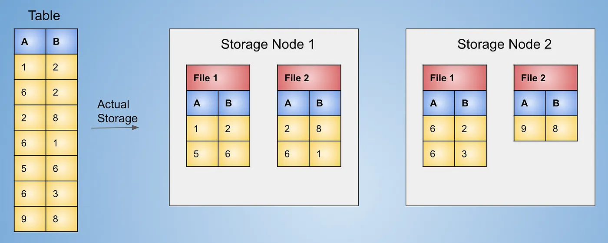

		- Il documento viene suddiviso in "chunks" più piccoli 
		- ciascun chunk viene assegnato ad una macchina diversa del cluster di calcolo. 
		- ogni macchina elabora un subset di parole o frasi del documento generando degli output intermedi.
		- Ol map trasforma i dati di input in coppie chiave-valore. Quindi, per ogni parola nel documento, la funzione di map emette una coppia chiave-valore, in cui la parola stessa è la chiave e il valore associato ad essa rappresenta il conteggio o un altro tipo di informazione.
		- Gli output intermedi vengono salvati all'interno del file system locale della macchina.

			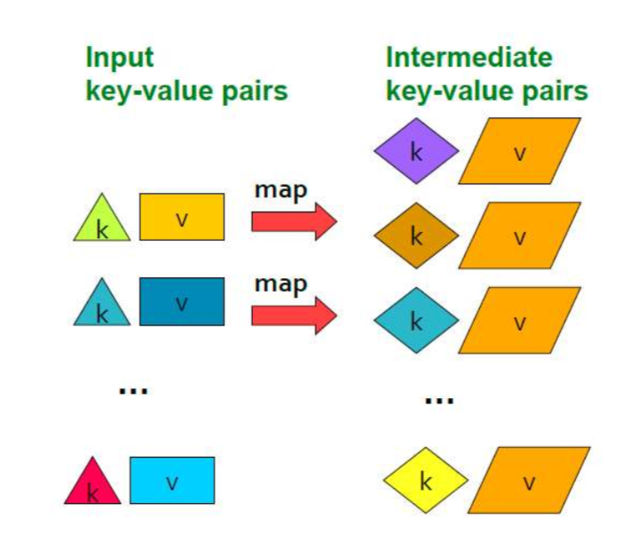
			- > **_Esempio:_**
			  *Input:* `Il cane corre nel parco. Il gatto corre in salotto.`
			  *Fase di Map:*
			  + *Chunk 1:* `Il cane corre nel parco.`
			  `("Il", 1),("cane", 1),("corre", 1),("nel", 1),("parco", 1)`
			  + *Chunk 2:* `Il gatto corre in salotto.`
			  `("Il", 1),("gatto", 1),("corre", 1),("in", 1),("salotto", 1)`
		- **GroupByKey**:

			- Il master deve raggruppare le coppie chiave-valore generati su ogni macchina (output intermedi)

			- il master node assegna delle chiavi ai server disponibili 

			- i server interrogano le macchine che hanno prodotto i valori intermedi.

			- viene creato un elenco di valori corrispondenti ad una chiave specifica.

			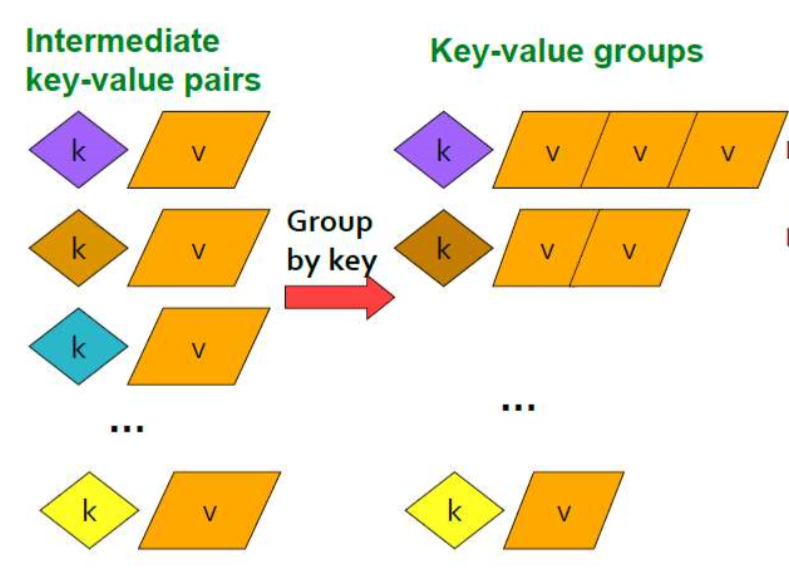

			- > **_Esempio:_**
			  `("Il", [1, 1]),("cane", [1]),("corre", [1, 1]),("nel", [1]),("parco", [1]),("gatto", [1]),("in", [1]),("salotto", [1])`
		- **Reduce**: Aggrega le coppie chiave-valore in base alla chiave comune.
		
			- il sistema passa attraverso ogni gruppo di valori corrispondenti a una chiave 
			
			- applica un'operazione di riduzione specificata dall'utente.
			
			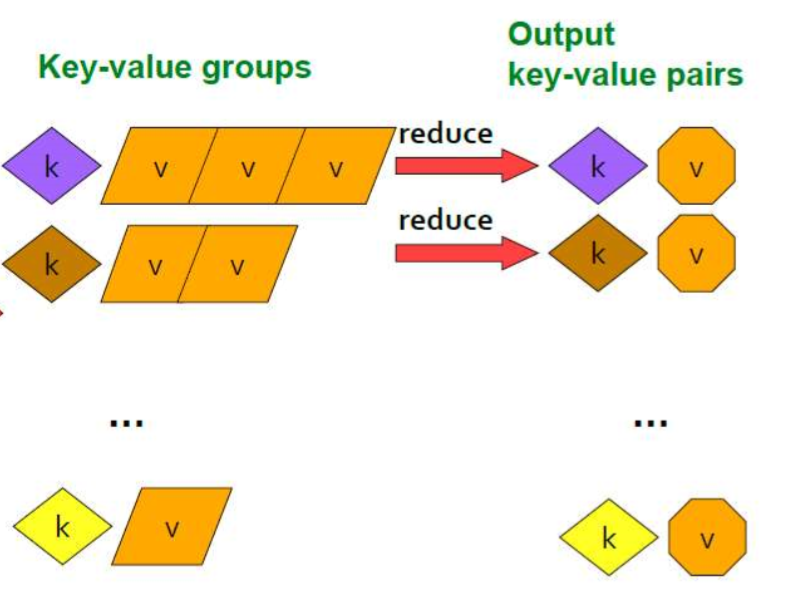

			> **_Esempio:_**
			`("Il", 2),("cane", 1),("corre", 2),("nel", 1),("parco", 1),("gatto", 1),("in", 1),("salotto", 1)`
		- > **_Oss:_** Gli input iniziali e gli output finali vengono salvati all'interno del file system distribuito. Gli input e gli output intermedi sono salvati all'interno dei file systems locali delle singole macchine.

	## **Algoritmi che usano il map-reduce**
	- molti algoritmi possono essere implementati usando il modello map-reduce.
	### **Prodotto matrice-vettore:** 
	- si usa ridurre il numero di operazioni necessarie per calcolare il prodotto matrice-vettore.
	- v deve rimanere in memoria per tutta la durata del calcolo.
	- mappa ogni elemento della matrice con il vettore 
		- **Input**: 
			- una matrice $M $ di dimensione $m \times n$ 
				- es: $$M = \begin{bmatrix} m11 & m12 \\ m21 & m22 \end{bmatrix}$$
			
			- un vettore $v$ di dimensione $n \times 1$			
				- es: $$v = \begin{bmatrix} v1 \\ v2 \end{bmatrix}$$
		- **Output**: 
			- un vettore $w$ di dimensione $m \times 1$ tale che $w = M \times v$

			- es: $$w = \begin{bmatrix} w1 \\ w2 \end{bmatrix} = \begin{bmatrix} m11 & m12 \\ m21 & m22 \end{bmatrix} \times \begin{bmatrix} v1 \\ v2 \end{bmatrix} = \begin{bmatrix} m11 \times v1 + m12 \times v2 \\ m21 \times v1 + m22 \times v2 \end{bmatrix}$$
			- se $v_1$ è distribuito su macchina 1, tutta la colonna $M_1$ è salvata su macchina 1 
				
				- $ w_1$ è calcolato su macchina 1
			
			- in generale per ogni elemento $w_i$ calcolato sulla macchina $m$ è necessario avere in memoria la riga $M_i$ e il vettore $v$.

		- **Algoritmo**:
			- **Map**: 
				- per ogni elemento $m_{ij}$ della matrice $M$ e per ogni elemento $v_{j}$ del vettore $v$, viene prodotta la seguente coppia chiave-valore: $(i,m_{ij} \times v_{j})$ dove $i$ è la chiave, $m_{ij}$ il valore della matrice $M$ e $v_{j}$ il valore del vettore $v$.
			- **Reduce**: 
				- per ogni chiave $i$, viene sommato il valore associato ad essa.

	### **Map Reduce per le operazioni di algebra relazionale**
	https://medium.com/swlh/relational-operations-using-mapreduce-f49e8bd14e31

	### Select: $\sigma_{c}(R)$
	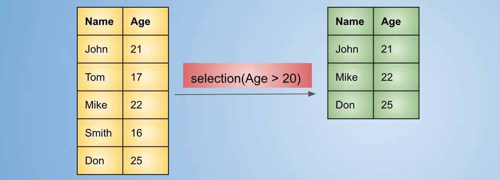
	- **Input**: 
		- una relazione $R$ 
		- una condizione $c$
	- **Output**:
		- una relazione $R'$ che contiene tutte le tuple di $R$ che soddisfano la condizione $c$
	- **Algoritmo**:
		- **Map**: 
			- per ogni tupla $t$ della relazione $R$, viene prodotta la seguente coppia chiave-valore: $(t,1)$ se $t$ soddisfa la condizione $c$, $(t,0)$ altrimenti.
		- **Reduce**: 
			- applica la funzione identità alle coppie chiave-valore prodotte dalla fase di map.
			
		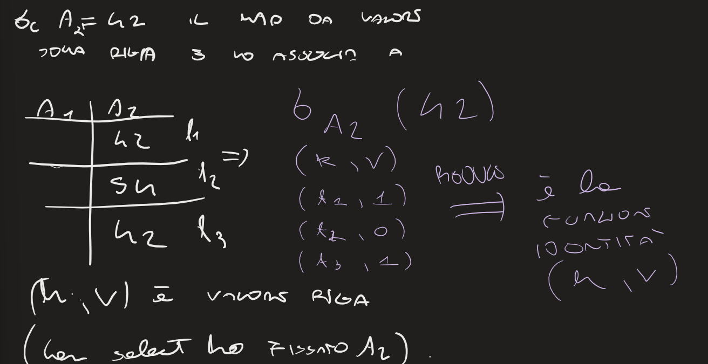

	### Projection: $$\pi_{A}(R)$$
	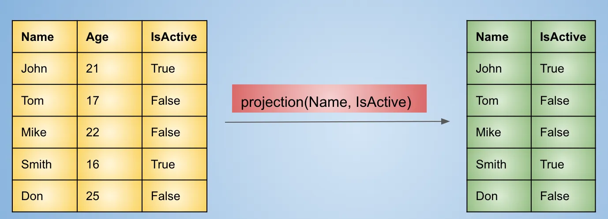
	- **Input**: 
	- una relazione $R$ 
	- un insieme di attributi $A$
	- **Output**:
	- una relazione $R'$ che contiene tutte le tuple di $R$ che soddisfano la condizione $c$
	- **Algoritmo**:
	- **Map**: 
		- per ogni tupla $t$ della relazione $R$, viene prodotta la seguente coppia chiave-valore: $(t[A],t)$ dove $t[A]$ è la proiezione di $t$ sugli attributi $A$.
	- **Reduce**: 
		- per ogni chiave $t[A]$, viene prodotta la seguente coppia chiave-valore: $(t[A],t)$ dove $t[A]$ è la proiezione di $t$ sugli attributi $A$.
				
	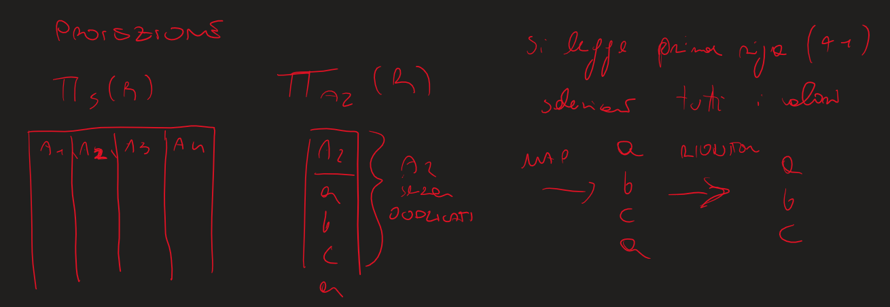
		
	### Join: $R$ $\cup$ $S$ 
	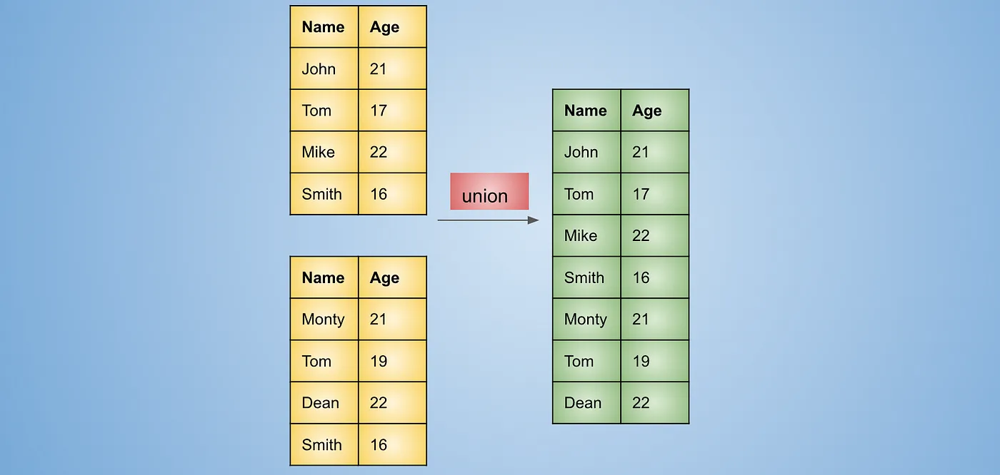
	- **Input**: 
		- due tabelle $R$ e $S$
		- una condizione $c = tutti gli elementi di R e S senza duplicati$
	- **Output**:
		- una tabella $T$ che contiene tutte le tuple di $R$ e $S$ che soddisfano la condizione $c$
	- **Algoritmo**:
	- **Map**: 
		- per ogni tupla $t$ delle tabelle, viene prodotta la seguente coppia chiave-valore: $(t, t) $ 
		- t, la riga della tabella, è la chiave e il valore.

		
	- **Reduce**:
		- per ogni chiave $t$, vengono raggruppati i valori associati ad essa e considerati come una unica riga.
		- le righe uguali vengono raggruppate in un unica riga.
	
	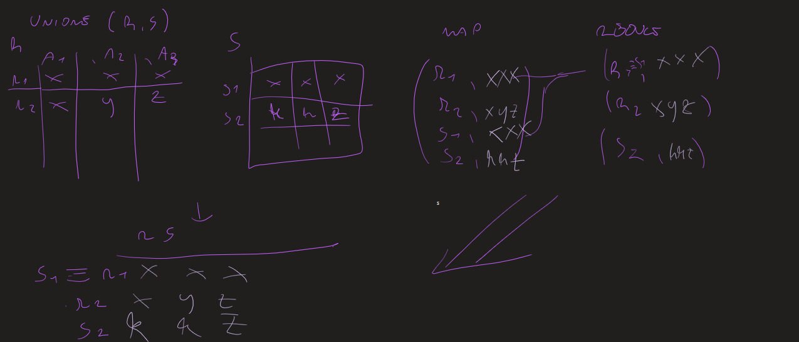

	### **Intersezione:** $R$ $\cap$ $S$
	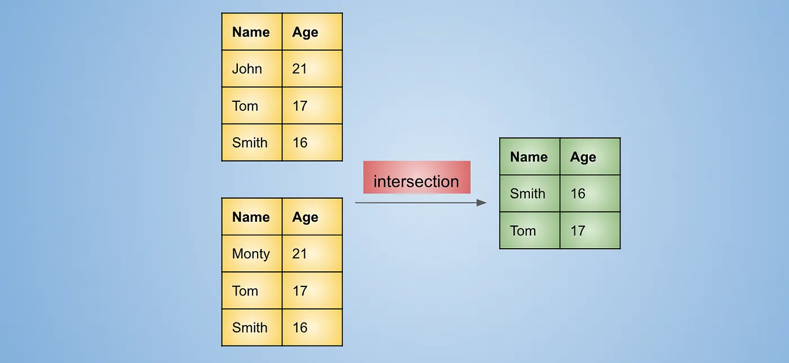
	- **Input**: 
		- due tabelle $R$ e $S$
		- una condizione $c =$ elementi in comune fra R e S
	- **Output**:
		- una tabella $T$ che contiene tutte le tuple di $R$ e $S$ che soddisfano la condizione $c$
	- **Algoritmo**:
	- **Map**: 
		- per ogni tupla $t$ delle tabelle, viene prodotta la seguente coppia chiave-valore: $(t, t) $ 
		- t, la riga della tabella, è la chiave e il valore.
	- **Reduce**:
		- per ogni chiave $t$, vengono proiettati quelle i cui valori associati sono uguali.
			- le righe uguali vengono proiettate in un unica riga.
			- quelle diverse vengono scartate.

	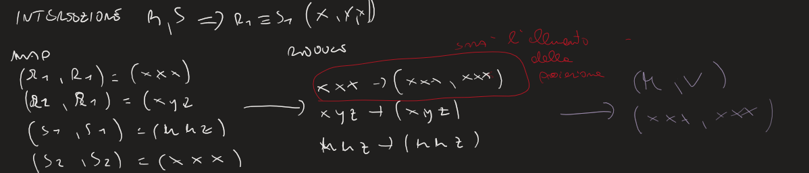

	### **Difference:** $R$ $-$ $S$
	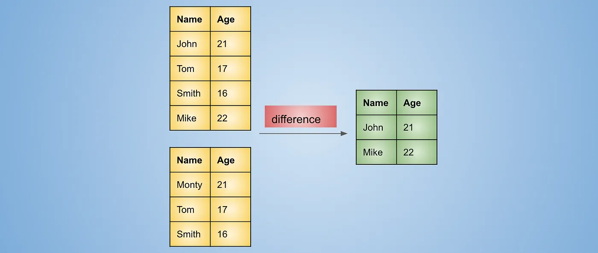
	- **Input**: 
		- due tabelle $R$ e $S$
		- una condizione $c =$ le righe uguali vengono scartate
	- **Output**:
		- una tabella $T$ che contiene tutte le tuple di $R$ e $S$ che soddisfano la condizione $c$
	- **Algoritmo**:
	- **Map**: 
		- per ogni tupla $t$ delle tabelle, viene prodotta la seguente coppia chiave-valore: $(t, R) $ 
		- t, la riga della tabella, è la chiave 
		- R o S, la tabella, è il valore.
	- **Reduce**:
		- per ogni chiave $t$, vengono proiettati quelle i cui valori associati sono uguali.
			- le righe uguali vengono scartate.
			- quelle diverse vengono proiettate ognuna in una riga della tabella T.
	
	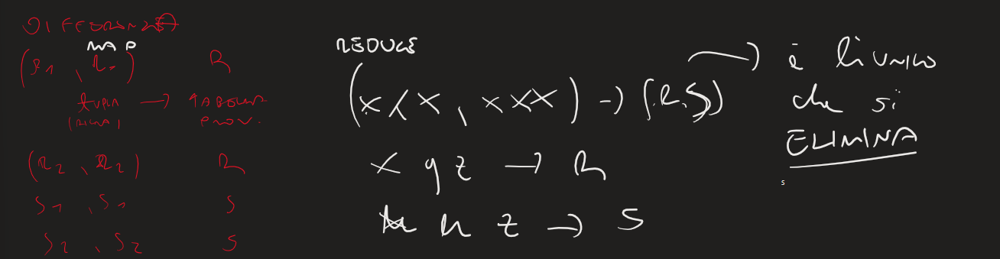

	### **Natural Join:** 
	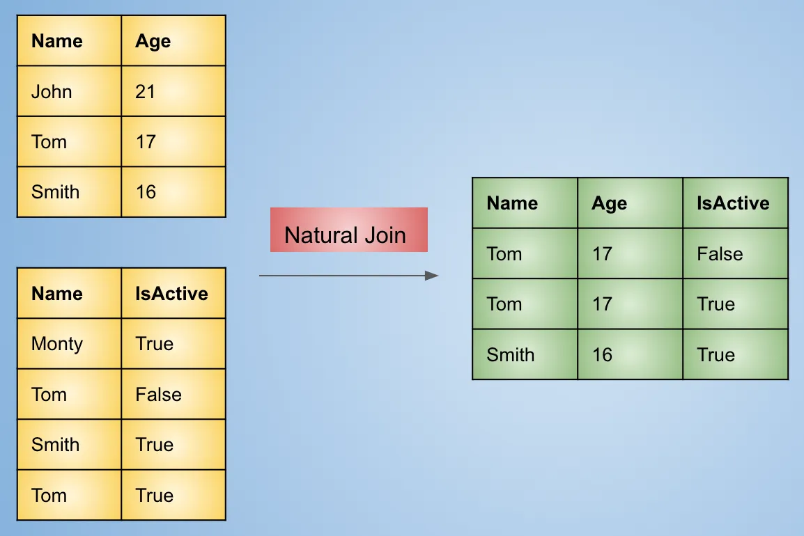

	- Il join naturale mantiene le righe che corrispondono ai valori della colonna comune per entrambe le tabelle. 
	- Si deve tenere traccia della tabella da cui proviene il valore. 
		- Se i valori per la stessa chiave provengono da tabelle diverse, dobbiamo formare coppie di quei valori insieme alla chiave per ottenere una singola riga di output. 

	- **Algoritmo**: 
		
	- **Map**: 
		- Per due relazioni Tabella 1(A, B) e Tabella 2(B, C) la funzione map creerà coppie chiave-valore della forma b: [(T1, a)] per la tabella 1, dove T1 rappresenta il fatto che il valore a proviene dalla tabella 1, per la tabella 2 le coppie chiave-valore saranno della forma b: [(T2, c)].
	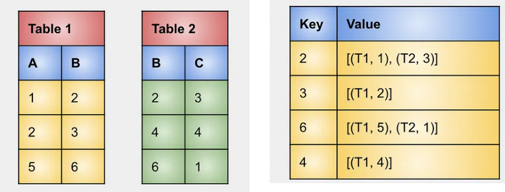
		
	- **Reduce**:

		- Per una data chiave b,
		
		- costruire tutte le possibili combinazioni di valori in cui un valore proviene dalla tabella T1 e l'altro dalla tabella T2. 

		- L'output sarà costituito da coppie chiave-valore della forma b: [(a, c)] che rappresentano una riga a, b, c per la tabella di output.

		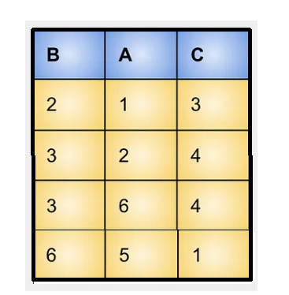

	### **Grouping and Aggregation:**

	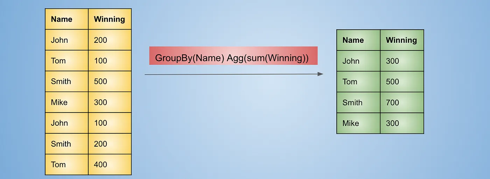

	- **Input**: 
		- una tabella $T$ e una funzione di aggregazione $f$
	- **Output**:
		- una tabella $T'$ che contiene una sola riga con il risultato dell'aggregazione
	- **Algoritmo**:
	- **Map**: 
		- la colonna rispetto alla quale si vuole aggregare viene usata come chiave
		- il valore è la riga della tabella contenente la chiave
		
	- **Reduce**:
		- per ogni chiave $k$, vengono raggruppati i valori associati ad essa e considerati come una unica riga.
		- le righe uguali vengono raggruppate in un unica riga.
		- viene applicata la funzione di aggregazione $f$ alla tabella risultante. (es: somma, media, max, min, ...)
	
	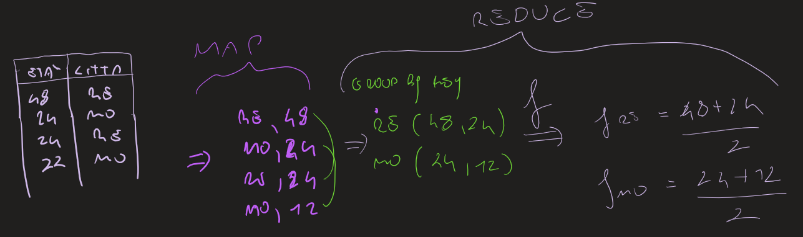

	## Prodotto Matriciale in two step
	- **Input**: 
		- due matrici $M$ e $N$ di dimensione $m \times n$ e $n \times p$ rispettivamente
	- **Output**:
		- una matrice $P$ di dimensione $m \times p$ tale che $P = M \times N$
		- es: $$P = \begin{bmatrix} m_{11} & m_{12} \\ m_{21} & m_{22} \end{bmatrix} \times \begin{bmatrix} n_{11} & n_{12} \\ n_{21} & n_{22} \end{bmatrix} = \begin{bmatrix} m_{11} \times n_{11} + m_{12} \times n_{21} & m_{11} \times n_{12} + m_{12} \times n_{22} \\ m_{21} \times n_{11} + m_{22} \times n_{21} & m_{21} \times n_{12} + m_{22} \times n_{22} \end{bmatrix} = \begin{bmatrix} p_{11} & p_{12} \\ p_{21} & p_{22} \end{bmatrix}$$
	- ### **Algoritmo**:
	- #### First step
	- L'obiettivo è generare i prodotti parziali unendo gli elementi dalla matrice $M$ e dalla matrice $N$ in base all'elemento $j$.
	
	- **Map 1**

	- Per ogni elemento $m_{ij}$ della matrice $M$ e per ogni elemento $n_{jk}$ della matrice $N$, vengono prodotte le seguenti coppie chiave valore:

		- $(j,(M,i,m_{ij})$ dove $j$ (indice di colonna) è la chiave, $M$ la matrice, $i$ l'indice di riga, $m_{ij}$ il valore;

		- $(j,(N,k,n_{jk})$ dove $j$ (indice di riga) è la chiave, $N$ la matrice, $k$ l'indice di colonna, $n_{jk}$ il valore;
		
		
		- > **_Esempio:_**
			$ M = \begin{bmatrix} m_{11} & m_{12} \\ m_{21} & m_{22} \end{bmatrix} $ , $ N = \begin{bmatrix} n_{11} & n_{12} \\ n_{21} & n_{22} \end{bmatrix} $

			+ $j=1$
			`(1,((M,1,m11),(M,2,m21),(N,1,n11),(N,2,n12))`

			+ $j=2$
			`(2,((M,1,m12),(M,2,m22),(N,1,n21),(N,2,n22))`

	- **Reduce 1**

	- Per ogni colonna $j$ vengono raggruppati i valori 
	- si raggruppa ogni valore proveniente dalla matrice $M$, $(M,i,m_{ij})$
	- con ogni valore $(N,k,n_{jk})$ proveniente dalla matrice $N$ 
	- con chiave $(i,k)$ e valore $m_{ij}n_{jk}$

	- > **_Esempio:_**
		+ `((1,1), m11 * n11), ((1,2), m11 * n12), ((2,1), m21 * n11), ((2,2), m21 * n12)`
		+ `((1,1), m12 * n21), ((1,2), m12 * n22), ((2,1), m22 * n21), ((2,2), m22 * n22)`

	- #### Second Step
		L'obiettivo è effettuare il raggruppamento e l'aggregazione dei risultati parziali ottenuti nella fase precedente.
		- **Map 2(identità)**
		
		Viene eseguita una copia dei risultati parziali ottenuti nella fase precendente.
		- > **_Esempio:_**
			+ `((1,1), m11 * n11), ((1,2), m11 * n12), ((2,1), m21 * n11), ((2,2), m21 * n12)`
				  + `((1,1), m12 * n21), ((1,2), m12 * n22), ((2,1), m22 * n21), ((2,2), m22 * n22)`
		- **Reduce 2**
			- si usa la somma come funzione di aggregazione
			- si sommano i valori associati a ogni chiave $(i,k)$
			- > **_Esempio:_**
				+ `((1,1), m11 * n11 + m12 * n21)`
				+ `((1,2), m11 * n12 + m12 * n22)`
				+ `((2,1), m21 * n11 + m22 * n21)`
				+ `((2,2), m21 * n12 + m22 * n22)`
	
	- ## Calcolo matriciale in one step
		- **Map**
			- Per ogni elemento $m_{ij}$ della matrice $M$, produrre $((i,k),(M,j, m_ij))$ per $k = 1, ..., \text{il numero di colonne di N} $.

			- Per ogni elemento $n_{jk}$ della matrice $N$, produrre $((i,k),(N,j, n_{jk}))$ per $i = 1, ...,\text{numero di righe di M}$ .
			
			- > **_Esempio:_** $ M = \begin{bmatrix} m_{11} & m_{12} \\ m_{21} & m_{22} \end{bmatrix} $ , $ N = \begin{bmatrix} n_{11} & n_{12} \\ n_{21} & n_{22} \end{bmatrix} $
			  
			- Il passaggio Map produce le seguenti coppie chiave-valore:
			+ `((1,1), (M,1, m11)), ((1,2),(M,1, m11))`
			+ `((1,1), (M,2, m12)), ((1,2),(M,2, m12))`
			+ `((2,1), (M,1, m21)), ((2,2),(M,1, m21))`
			+ `((2,1), (M,2, m22)), ((2,2),(M,2, m22))`
			+ `((1,1), (N,1, n11)), ((2,1),(N,1, n11))`
			+ `((1,2), (N,1, n12)), ((2,2),(N,1, n12))`
			+ `((1,1), (N,2, n21)), ((2,1),(N,2, n21))`
			+ `((1,2), (N,2, n22)), ((2,2),(N,2, n22))`

		- **Shuffle**
			- Raggruppare le coppie chiave-valore in base alle loro chiavi, ottenendo le coppie chiave-valore intermedie.
				- > **_Esempio:_**
				  + `((1,1), (M,1, m11), (M,2, m12), (N,1, n11), (N,2, n21))`
				  + `((1,2), (M,1, m11), (M,2, m12), (N,1, n12), (N,2, n22))`
				  + `((2,1), (M,1, m21), (M,2, m22), (N,1, n11), (N,2, n21))`
				  + `((2,2), (M,1, m21), (M,2, m22), (N,1, n12), (N,2, n22))`
		- **Reduce**
			- Per ogni chiave $(i,k)$, che rappresenta un elemento della matrice risultante, abbiamo una lista di valori provenienti sia dalla matrice $M$ che da $N$, associati a diversi valori di $j$. Si devono connettere i valori corrispondenti da $M$ e $N$ con lo stesso $j$ e calcolare il risultato parziale.
				
				- > **_Esempio:_**
				+ `((1,1), m11 * n11)`
				+ `((1,1), m12 * n21)`
				+ `((1,2), m11 * n12)`
				+ `((1,2), m12 * n22)`
				+ `((2,1), m21 * n11)`
				+ `((2,1), m22 * n21)`
				+ `((2,2), m21 * n12)`
				+ `((2,2), m22 * n22)`

			- Infine, si sommano i risultati parziali per ottenere il risultato finale della moltiplicazione delle matrici.

				- > **_Esempio:_**
				  + `((1,1), m11 * n11 + m12 * n21)`
				  + `((1,2), m11 * n12 + m12 * n22)`
				  + `((2,1), m21 * n11 + m22 * n21)`
				  + `((2,2), m21 * n12 + m22 * n22)`
	
	- ## Reducer Size e Replication Rate

		- **Replication Rate (r):**

			- È il numero di coppie chiave-valore prodotte durante la fase di Map a partire da tutti gli input, diviso il numero totale di input.
			- Rappresenta la comunicazione media tra i compiti di Map e quelli di Reduce, misurata dal numero di coppie chiave-valore prodotte.
				- > **_Esempio:_** Nel caso del calcolo matriciale one step di matrici $n \times n$, la replication rate $r$ è pari a $n$:
				  + Per ogni elemento $m_{ij}$, vengono generate $n$ coppie chiavi valore;
				  + Per ogni elemento $n_{jk}$, vengono generate $n$ coppie chiavi valore;
		- **Reducer Size (q):**
			- Rappresenta il limite superiore sul numero di valori associati a una singola chiave.
			- Abbassando il valore di q, è possibile aumentare il parallelismo e ridurre il tempo di esecuzione complessivo. Inoltre, per valori di q sufficientemente bassi, è possibile eseguire interamente il calcolo in memoria principale, evitando spostamenti inutili di dati tra memoria e disco.
				- > **_Esempio:_** Nel caso del calcolo matriciale one step di matrici $n \times n$, il reducer size necessario $q$ è pari a $2n$:
				  + Per ogni coppia $(i,k)$, ci sono $n$ coppie chiave-valore per ciascuna matrice
		- In generale, c'è un trade-off tra $r$ e $q$, e si applica la condizione $qr ≥ 2n^2$ per garantire un corretto bilanciamento tra la comunicazione tra mappatori e riduttori e le dimensioni dei riduttori stessi.